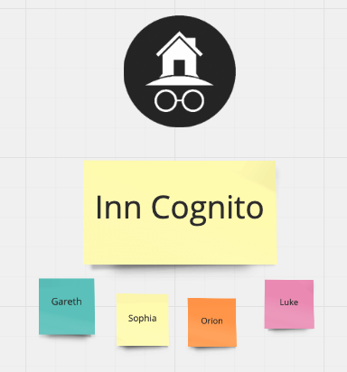
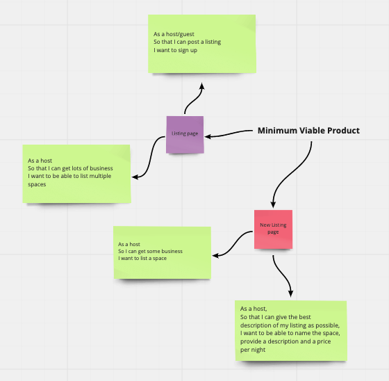
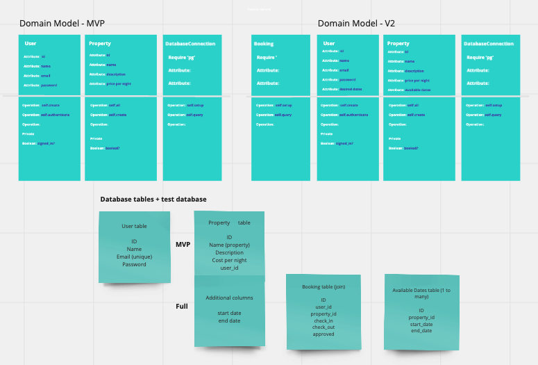
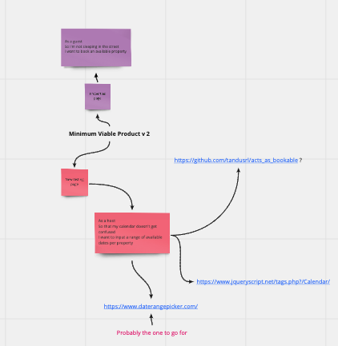
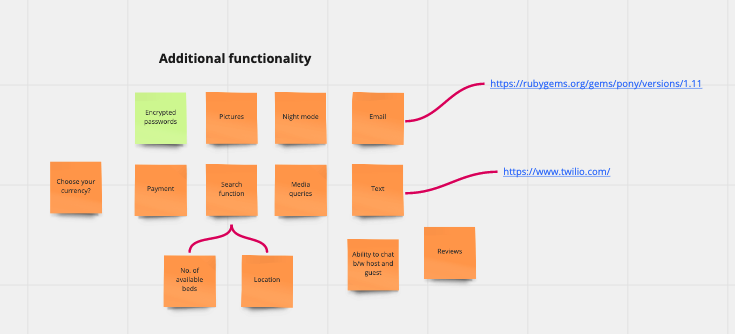

# Inncognito

## Makers Academy - Week 6 (group project)

Contributors: Luke Donovan, Orion Reed, Gareth Harris, Sophia Bell

[Outline](#Outline) | [Specifications](#Specifications) | [Planning](#planning) | [Installation Instructions](#install) | [Tech stack](#tech) | [Challenges](#challenges)

## [Outline](#Outline) 

Work as a team to build a clone of Airbnb

## [Specifications](#Specifications)

### User Stories

**Primary**
```
As a user
So that I can post or book a listing
I would like to sign-up

As a host
So that I can rent out my room
I would like to post a listing

As a host
So I can get lots of business
I would like to be able post multiple properties

As a guest
So I'm not sleeping in the street
I would like to be able to book a room

As a guest
So I am not sharing with a stranger
I can't book a room thats been booked by someone else

As a host
So I can accurately list my room
I can include when the room is available in the listing

As a host
So I can accurately advertise my room
I would like my listing to contain the name, description and price per night of the space

As a host 
So that I can get as much business as possible
I want my room to be available to book until a booking has been confirmed
```
**Secondary**
```
As a guest
So that I iknow my sign-up has been successful
I would like to receive an email confirmation

As a guest
So I know that my booking has been successful
I would like to recieve an email booking confirmation

As a guest
So that I know if my booking has been unsuccessful
I would like to receieve an email notifying me that my booking has been denied

As a host
So that I am not out of pocket
I would lke to recieve payments for my bookings

As a host
So I can notify inncognito of a change to my property
I would like to update the details of a listed property
```

## [Planning](#planning)

**Day 1**

- Setting up of our group [Miro board](https://miro.com/welcomeonboard/BygBxwTmsSAHgAoJdncfqCDWS1yPZqBuMK9G32QTrosYQe6jNTAl2o6bD217YS5u)
- Coming up with a name



- Deciding on our minimum viable product




- Pair programming
- Merge branches and retro

**Day 2**

- Pair programming
- Finishing off our mvp
- Merge branches and retro

**Day 3**

- Deciding on Inncognito's second iteration



- Pair programming
- Merge branches and retro

**Day 4**

- Individual work due to various peer group meetings
- Looking at additional functionality



- Merge branches and retro

**Day 5**

- Finishing off details, CSS etc.

## [Installation Instructions](#install)

**Getting started**

`git clone https://github.com/lukedonov/makersbnb-project.git`

`bundle`

**Setting up the databases**

Connect to `psql` 

Run the SQL scripts in the `db/migrations` folder in the given order.

**Usage**

Navigate to `http://localhost:9292/`

**Running tests**

`rspec`

## [Tech stack](#tech) 

Back-end:

* Ruby

Front-end:
* CSS/HTML
* Javascript
* JQuery

Testing:

* Capybara
* RSpec
* SimpleCov

Linting:

* Rubocop

## [Challenges](#challenges)

* Working remotely for our first project was initially quite daunting but we managed pretty well - we kept in contact every day with stand ups and retros, and constant updates throughout the day as to our progress.
* 
